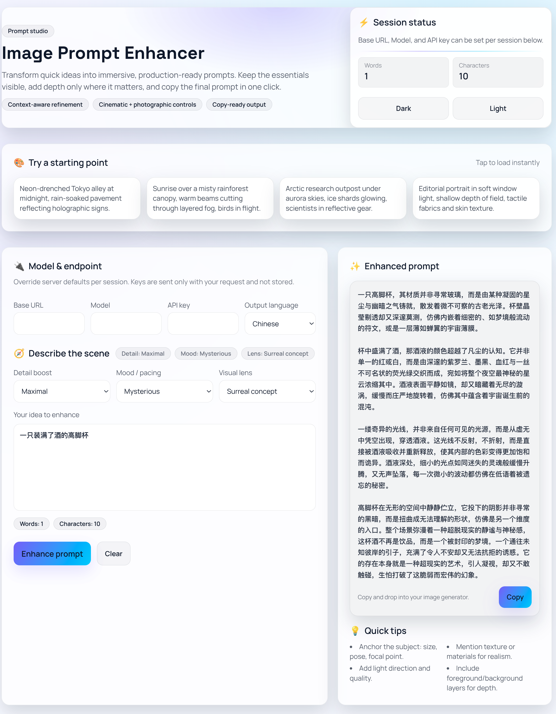

## Image Prompt Enhancer (TypeScript)

A TypeScript rebuild of the original Streamlit app. React + Vite UI on top of a small Express proxy (OpenAI-compatible) keeps your key server-side. The UI now includes light/dark themes, glassmorphic cards, curated suggestions, refinement sliders, prompt stats, and a copy-ready enhanced output.

### Features
- Light/dark toggle with theming preserved across the layout.
- Connection panel to override Base URL, Model, and API key per session (values travel only in your request).
- Guided refinement (detail, mood, visual lens) plus prompt stats and one-click copy.
- Tailwind CSS, React, Vite frontend; Express + OpenAI SDK backend.




### Quick Start (dev)
1) Install deps (Node 20+):
```bash
npm install
```
2) Set defaults (optional if you plan to enter them in the UI):
```bash
export PROMPT_ENHANCER_BASE_URL="https://openrouter.ai/api/v1"
export PROMPT_ENHANCER_MODEL="moonshotai/kimi-k2:free"
export PROMPT_ENHANCER_API_KEY="your-api-key"
```
3) Run UI + API together:
```bash
npm run dev:full
```
   - API proxy: http://localhost:8501
   - Vite dev UI: http://localhost:5173 (proxies /api)

### Production Build
```bash
npm run build   # bundle UI + compile server to dist/
npm start       # serve dist on PORT (default 8501)
```

### Docker
Build:
```bash
docker build -t noton-image-prompt-enhancer .
```
Run:
```bash
docker run --rm -it -p 8501:8501 \
  -e PROMPT_ENHANCER_BASE_URL=xxx \
  -e PROMPT_ENHANCER_MODEL=xxx \
  -e PROMPT_ENHANCER_API_KEY=xxx \
  noton-image-prompt-enhancer
```

### Environment Variables
- `PROMPT_ENHANCER_BASE_URL` - LLM endpoint URL (default https://openrouter.ai/api/v1).
- `PROMPT_ENHANCER_MODEL` - model id/name (default moonshotai/kimi-k2:free).
- `PROMPT_ENHANCER_API_KEY` - required API key for the provider.
- `PORT` or `PROMPT_ENHANCER_PORT` - optional server port, defaults to 8501.
- UI overrides: the web UI lets you provide Base URL / Model / API key per session; those values override env defaults.

### Scripts
- `npm run dev` - Vite UI only.
- `npm run dev:server` - API proxy only.
- `npm run dev:full` - run UI + API together (dev flow).
- `npm run build` - build UI and compile server.
- `npm start` - start the compiled server (serves built UI + API).
